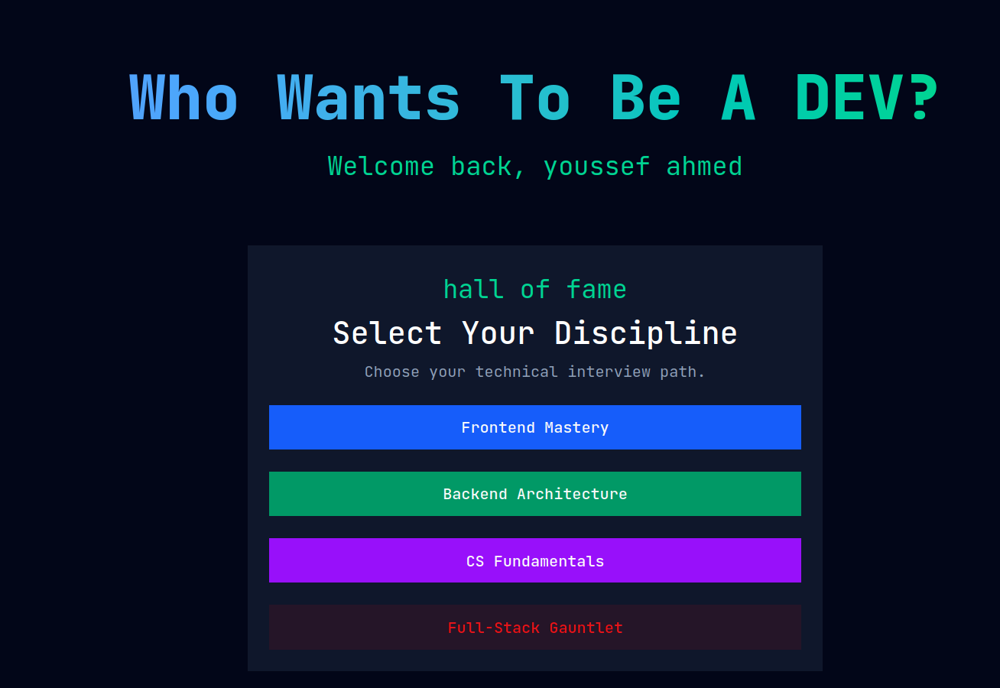
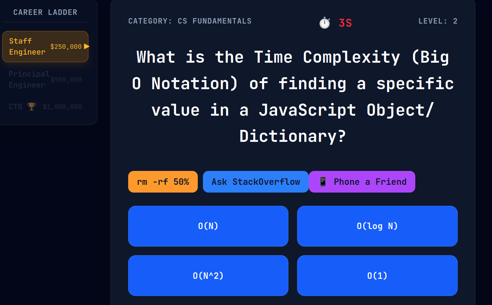

<div align="center">

#  Who Wants To Be A Developer?

### *The High-Stakes Technical Interview Simulator*

[](https://who-wants-to-be-a-millionaire-for-p.vercel.app)
[](https://github.com/Youssef-Ahmed1/who-wants-to-be-a-millionaire-for-programmers-)
[](https://nextjs.org/)
[](https://www.typescriptlang.org/)
[](https://www.mongodb.com/)
[](https://tailwindcss.com/)
[](https://jestjs.io/)
[](https://playwright.dev/)

</div>

---

##  The Challenge

**What if your technical interview was a game?**

Most developers prepare for interviews with flashcards and LeetCode. Boring. Passive. Unrealistic.

**Who Wants To Be A Developer** turns interview prep into a **high-stakes, timed challenge**. You face 15 questions, a 15-second timer, and a career ladder that tracks your progression from "Applicant" to "CTO." Every wrong answer is a missed promotion. Every second wasted is a missed opportunity.

**The pressure is real. The stakes are high. The experience is unforgettable.**

---

##  Key Features

| Feature | Description |
|---------|-------------|
|  **15-Second Timer** | Auto-fail if you don't answer in time. Tick sound intensifies in the final 5 seconds. |
|  **Career Ladder** | Progress from "Applicant" → "Bootcamp Grad" → "Intern" → "Junior Engineer" → "Engineer" → "Senior Engineer" → "Lead" → "Staff" → "Principal" → **"CTO"** with salary milestones ($100 → $1,000,000). |
|  **Three Lifelines** | • **50/50** – Removes two wrong answers (aka `rm -rf 50%`). <br> • **StackOverflow** – Audience poll showing vote distribution. <br> • **Phone a Friend** – Personality-driven hints that mock you on easy questions and respect you on hard ones. |
|  **Authentication** | Full sign-up/login flow with NextAuth.js. Save your high score to the global leaderboard. |
|  **Global Leaderboard** | See where you rank among other developers. |
|  **Responsive** | Full career ladder on desktop; compact card + progress bar on mobile. |
|  **Sound Effects** | Correct, wrong, and ticking sounds for immersive feedback. |
|  **Tested** | Unit tests (Jest) and E2E tests (Playwright) ensure reliability. |

---

## Tech Stack

### Frontend
- **Next.js 15** (App Router) – React framework with server components and API routes.
- **TypeScript** – Type-safe code that prevents bugs at compile time.
- **Tailwind CSS** – Utility-first styling for rapid UI development.
- **Zustand** – Minimal, scalable state management for global game state.

### Backend
- **MongoDB** (Mongoose ODM) – NoSQL database for user data and questions.
- **NextAuth.js** – Authentication with Credentials Provider and bcrypt hashing.
- **Server Actions** – Secure, type-safe server-side logic for auth and data mutations.

### Testing & Deployment
- **Jest** – Unit tests for pure logic (lifelines, scoring, leaderboard).
- **Playwright** – E2E tests for full user journeys and critical flows.
- **Vercel** – Continuous deployment with automatic previews.

---

## Screenshots

<div align="center">
  
  <br />
  
</div>

---

## Getting Started

### Prerequisites
- Node.js 18+
- MongoDB Atlas account (or local MongoDB instance)
- Git

### Installation

1. **Clone the repository:**
   ```bash
   git clone https://github.com/Youssef-Ahmed1/who-wants-to-be-a-millionaire-for-programmers-.git
   cd coding-millionaire
   ```

2. **Install dependencies:**
   ```bash
   npm install
   ```

3. **Set up environment variables:**
   Create a `.env.local` file in the root:
   ```env
   MONGODB_URI=your_mongodb_connection_string
   NEXTAUTH_SECRET=your_nextauth_secret
   NEXTAUTH_URL=http://localhost:3000
   ```

4. **Seed the database (optional):**
   ```bash
   npm run seed
   ```

5. **Run the development server:**
   ```bash
   npm run dev
   ```

6. **Open your browser:**
   Navigate to `http://localhost:3000`

---

##  Testing

```bash
# Unit tests (Jest)
npm run test

# E2E tests (Playwright)
npx playwright test
```

---

## Project Structure

```
src/
├── app/          # Next.js App Router (Pages, API routes)
├── components/   # Reusable UI components (Ladder, Cards, Buttons)
├── lib/          # Pure logic (Lifelines, Scoring, DB connection)
├── models/       # MongoDB schemas (User, Question)
├── store/        # Zustand global state
└── types/        # TypeScript interfaces
```

---

## Future Improvements

- [ ] **Multiplayer Mode** – Compete against others in real-time.
- [ ] **Question Editor** – Admin dashboard to create and edit questions.
- [ ] **Achievement Badges** – Unlockable rewards for milestones.
- [ ] **PWA Support** – Installable on mobile for offline play.
- [ ] **AI Chatbot** – Explain why the answer is correct.

---

## About the Author

I'm Youssef Ahmed, a Full-Stack Software Engineer specializing in modern MERN stack development, scalable backend architecture, and relational database management.

I bridge the gap between complex server logic and clean, dynamic user interfaces. In my recent role as a Full-Stack Engineer at Glowply, I architected custom RESTful APIs, optimized MySQL database queries, and led refactoring sprints to secure authentication pipelines (migrating from legacy token storage to robust HttpOnly cookie architectures).

My engineering philosophy is built on **Defensive Programming** and **Separation of Concerns**. I don't just write code that works on the "happy path"—I anticipate failure matrices, enforce strict data validation, and optimize execution contexts to ensure the server remains stable under load.

**I'm currently seeking remote opportunities.** Let's connect.

[](https://github.com/Youssef-Ahmed1)
[](https://www.linkedin.com/in/youssef-ahmed-yyoussefdoinwork/)

---

##  License

This project is open source and available under the [MIT License](LICENSE).

---

<div align="center">
  <sub>Built with ❤️ by Youssef Ahmed</sub>
</div>
